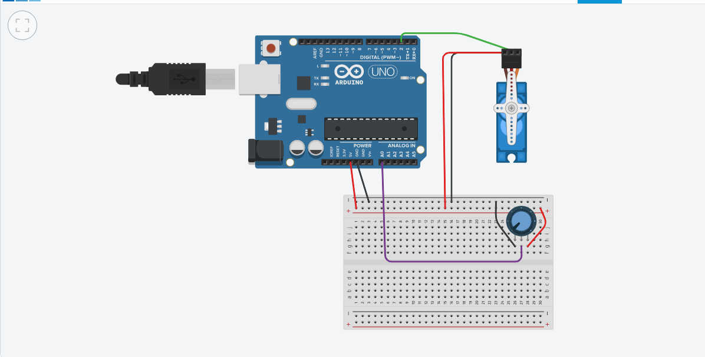

# Servo Potentiometer Control

Arduino project for controlling a servo motor with a potentiometer.  

## Stack
- Arduino C++
- Servo library

## Features
- Maps potentiometer value (0-1023) to servo angle (0-180°)
- Custom pulse widths (400-2600 µs) for compatibility
- 20ms delay for stable operation
- Analog read and map function usage

## Wiring
- Potentiometer: Analog pin A0
- Servo signal: Digital pin 2
- Servo power: External 5-6V recommended

## How to Use
- Upload to Arduino board
- Rotate potentiometer to control servo

## Demo
  

Simulation https://www.tinkercad.com/things/74invD1FaJS-p6-yuliya?sharecode=wOePKZrqa3ESnTHs7Y1AHyj73EKz20ha0gfMPPowP7A
